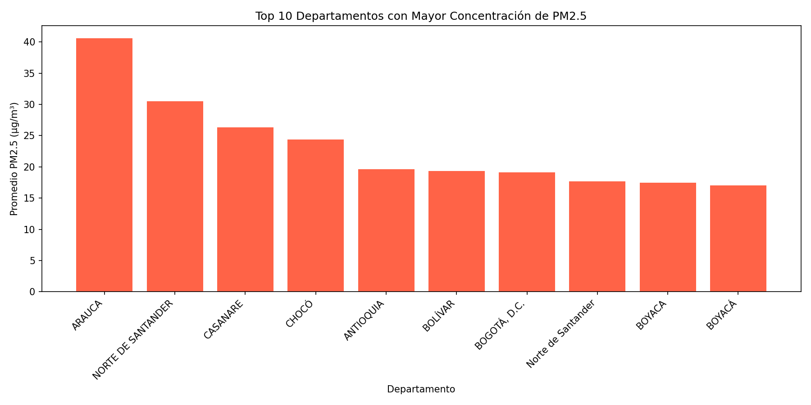
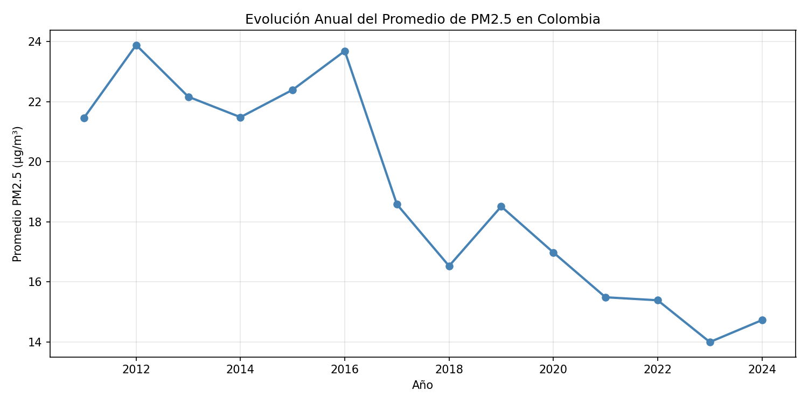
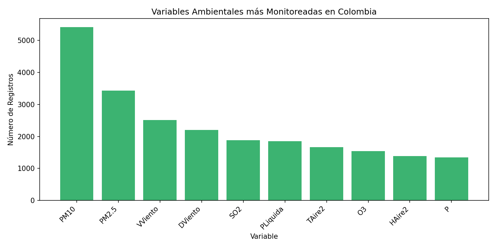

# 📊 Big Data - Calidad del Aire en Colombia
### Tarea 3 - Procesamiento de Datos con Apache Spark
**Universidad Nacional Abierta y a Distancia – UNAD**  
Curso: Big Data (Código: 202016911) | Grupo: 47

---

## 👤 Autor
- Sebastián López

**Docente:** Fabián Augusto Ávila Orjuela

---

## 📋 Descripción del Proyecto

Este proyecto implementa una solución de procesamiento de grandes volúmenes de datos sobre la **Calidad del Aire en Colombia**, aplicando:

- **Procesamiento en Batch** con Apache Spark (PySpark)
- **Procesamiento en Tiempo Real** con Apache Kafka + Spark Structured Streaming

### 🗂️ Dataset
**Calidad del Aire en Colombia – Promedio Anual**  
Fuente: [Datos Abiertos Colombia](https://www.datos.gov.co/Ambiente-y-Desarrollo-Sostenible/Calidad-Del-Aire-En-Colombia-Promedio-Anual-/kekd-7v7h/about_data)

| Característica | Detalle |
|---|---|
| Registros | 29.683 |
| Columnas | 28 |
| Cobertura temporal | 2011 – 2024 |
| Variables | PM2.5, PM10, SO2, NO2, O3, CO, temperatura, humedad, presión, viento |

---

## 🗃️ Estructura del Repositorio

```
big-data-calidad-aire-colombia/
│
├── batch_calidad_aire.py          # Procesamiento en batch con PySpark
├── kafka_producer_aire.py         # Producer Kafka con datos reales del dataset
├── spark_streaming_aire.py        # Consumer Spark Structured Streaming
├── README.md                      # Este archivo
│
└── graficas/
    ├── grafica1_pm25_departamentos.png   # Top 10 departamentos con mayor PM2.5
    ├── grafica2_evolucion_anual.png      # Evolución anual PM2.5 2011-2024
    └── grafica3_variables.png            # Variables ambientales monitoreadas
```

---

## ⚙️ Requisitos

- Apache Spark 3.5.8
- Apache Kafka 3.9.2
- Python 3.12
- PySpark
- kafka-python
- matplotlib
- pandas

---

## 🚀 Instrucciones de Ejecución

### 1. Procesamiento en Batch

```bash
# Instalar dependencias
pip install matplotlib pandas --break-system-packages

# Ejecutar análisis batch
spark-submit batch_calidad_aire.py
```

### 2. Procesamiento en Tiempo Real (Kafka + Spark Streaming)

**Terminal 1 — Iniciar ZooKeeper:**
```bash
sudo /opt/Kafka/bin/zookeeper-server-start.sh /opt/Kafka/config/zookeeper.properties
```

**Terminal 2 — Iniciar Kafka:**
```bash
sudo /opt/Kafka/bin/kafka-server-start.sh /opt/Kafka/config/server.properties
```

**Terminal 3 — Crear topic y ejecutar producer:**
```bash
/opt/Kafka/bin/kafka-topics.sh --create --bootstrap-server localhost:9092 --replication-factor 1 --partitions 1 --topic calidad_aire_stream

python3 kafka_producer_aire.py
```

**Terminal 4 — Ejecutar consumer Spark Streaming:**
```bash
spark-submit --packages org.apache.spark:spark-sql-kafka-0-10_2.12:3.5.8 spark_streaming_aire.py
```

---

## 📊 Resultados del Análisis Batch

### Top 10 Departamentos con Mayor Concentración de PM2.5


### Evolución Anual del Promedio de PM2.5 en Colombia (2011-2024)


### Variables Ambientales más Monitoreadas


---

## 🔍 Hallazgos Principales

- **Arauca** presenta la mayor concentración promedio de PM2.5 (40.6 μg/m³)
- **Tendencia positiva:** el promedio nacional de PM2.5 bajó de 21.46 μg/m³ en 2011 a 14.73 μg/m³ en 2024
- **PM10** es la variable más monitoreada con 5.413 registros, seguida por PM2.5 con 3.429
- Las estaciones más contaminadas se concentran en **Arauca, Antioquia y Cundinamarca**

---

## 📡 Procesamiento en Tiempo Real

El producer lee directamente el dataset real de Calidad del Aire y envía registros de PM2.5 uno por uno al topic de Kafka `calidad_aire_stream`, simulando la llegada de datos en tiempo real.

El consumer con Spark Structured Streaming calcula:
- Promedio de contaminación por departamento y variable en ventanas de 1 minuto
- Total de excedencias por departamento en ventanas de 1 minuto
